# Standard ANM Dataset
## Standard Datasets for Autonomous Navigation and Mapping: A Full-Stack Construction Methodology

### Authors: 
[Yuanzhi Liu](https://github.com/lyzrose), [Yujia Fu](https://github.com/yayafu666)†, [Minghui Qin](https://github.com/SJTU-qin)†, [Yufeng Xu](https://github.com/feng15423)†, et al. († Contributed equally)

## Abstract: 
The development of intelligent Vehicles (IVs) requires extensive standard datasets for training, benchmarking, and improvement. Autonomous Navigation and Mapping (ANM), as a critical technology for IVs, imposes exceptionally high demands on dataset construction. This is significant in its requirements for comprehensive sensor calibration, precise time synchronization, and accurate generation of ground truth. Besides, the whole construction workflow also demands intricate knowledge and sophisticated practices, necessitating lengthy learning curves for researchers to attain proficiency. The above challenges have led to a slow production of qualified datasets, directly constraining the advancement of ANM. However, so far, an investigation focused on a mature construction methodology of ANM dataset is still missing. This paper strives to fill the gap. Specifically, based on our systematic reviews and extensive practices, for the first time, a full-stack construction methodology of ANM dataset is proposed, including modules of platform construction, sensor calibration, time synchronization, ground truth generation, synthetic data production, and benchmark criteria, with detailed techniques and methodological routes provided in each step. Several long-standing issues are resolved within the methodology. Importantly, we introduce versatile calibration and synchronization frameworks that attain up to us-level and mm-level precision. Besides, we propose a full-scenario ground truth system that can generate scene-map and trajectory at cm-level accuracy. To verify the effectiveness of our methodology, we design a high-quality dataset and benchmark multiple state-of-the-art algorithms on it. The successful workflow demonstrates that our methodology can significantly reduce the research threshold and help individuals and institutions to construct datasets in a standardized way.

# News!!!
### We introduce two new datasets into our standard dataset community: SEIEE + YULAN
For navigation algorithm testing in large-scale **Office Building** and **Residential Block** scenarios respectively.

## SEIEE Datasets: 

> [!NOTE]10sequences, 6.3km, 21140m2

* **Timeslots**: `Night` `Afternoon`
* **Challenges**: `Low-texture` `Degradation` `Lighting Change`
* **Senarios**: `Long Corridor` `White Wall` `Reflective Floor`
* **Sensors**: `Stereo Vision` `Spining+MEMS LiDAR` `IMU` `Wheel Odom`

Stat/Sequence|1010-00|1010-01|1010-02|1010-03|1010-04
:--:|:--:|:--:|:--:|:--:|:--:
Size/GB|24.3/4.8|25.0/5.1|26.3/5.3|41.7/8.2|13.8/2.9
Distance/m|530.9|579.8|615.7|923.9|317.0
Duration/s|481.7|499.3|516.5|808.3|281.0
VLIO-rosbag|[onedrive](https://1drv.ms/u/s!AhiXYfoNKvqcgR8OD_GYDqwF4fUv?e=eZ3tKb) [baidu](https://pan.baidu.com/s/1SsSHVatM52tmVIb9c2JQCA?pwd=sjtu)|[onedrive](https://1drv.ms/u/s!AhiXYfoNKvqcgR5NdkVvv5-jwg9S?e=BpTw3M) [baidu](https://pan.baidu.com/s/1e1nvLn6kNRXW_8ZkAF-DUw?pwd=sjtu)|[onedrive](https://1drv.ms/u/s!AhiXYfoNKvqcgSIMMHWnaIRWOQEh?e=1fTNoL) [baidu](https://pan.baidu.com/s/1LrHyfvJAxyBma82iGaVL7g?pwd=sjtu)|[onedrive](https://1drv.ms/u/s!AhiXYfoNKvqcgSC5ZoiW8ff5VxW1?e=RBOYIK) [baidu](https://pan.baidu.com/s/1NohF3MTXmjfKZNMEn3hVdA?pwd=sjtu)|[onedrive](https://1drv.ms/u/s!AhiXYfoNKvqcgSFxGk-1Y0cnuzGi?e=0L8HcO) [baidu](https://pan.baidu.com/s/1m37eIgWroUVa9jBSDw4NQA?pwd=sjtu)
LIO-rosbag|[onedrive](https://1drv.ms/u/s!AhiXYfoNKvqcgQ_K8PgFz_LvzIiZ?e=PQdgRs) [baidu](https://pan.baidu.com/s/1olc4R9P04dEz8XRQicdWfg?pwd=sjtu)|[onedrive](https://1drv.ms/u/s!AhiXYfoNKvqcgRXMxjKNsiS-zBZ5?e=75pZVv) [baidu](https://pan.baidu.com/s/1dxjVL6SKLWYkGeObFeWyjQ?pwd=sjtu)|[onedrive](https://1drv.ms/u/s!AhiXYfoNKvqcgRd_2k4zpH111fZ8?e=w6xjtp) [baidu](https://pan.baidu.com/s/1rg0p53cHUlwh0HN-hMT70w?pwd=sjtu)|[onedrive](https://1drv.ms/u/s!AhiXYfoNKvqcgRNIbWeKNmQY2WM2?e=5LycAJ) [baidu](https://pan.baidu.com/s/1PIhjam4ld3sIvGiQ6t1bSA?pwd=sjtu)|[onedrive](https://1drv.ms/u/s!AhiXYfoNKvqcgRDbU7qgJKgHbHab?e=94tdSe) [baidu](https://pan.baidu.com/s/1ss1E3gMQeLkF1dYAPgsNEQ?pwd=sjtu)
GT-pose|[onedrive](https://1drv.ms/u/s!AhiXYfoNKvqcgS_Biux3orZVTdMN?e=3cTevn) [baidu](https://pan.baidu.com/s/1w6-pZgiYUuayqVNZ06AjLw?pwd=sjtu)|[onedrive](https://1drv.ms/u/s!AhiXYfoNKvqcgS6Gv7ORcQiXVBGK?e=Y4pNZH) [baidu](https://pan.baidu.com/s/1FZ4B9lHqvmAEp7Bu6sWBHQ?pwd=sjtu)|[onedrive](https://1drv.ms/u/s!AhiXYfoNKvqcgTFNhUa1t8UAwOW-?e=LObN5Z) [baidu](https://pan.baidu.com/s/1KaC7Jv9AIiKbyk4if9aWjw?pwd=sjtu)|[onedrive](https://1drv.ms/u/s!AhiXYfoNKvqcgTIwW7NjK-WwWf4q?e=ocEbf5) [baidu](https://pan.baidu.com/s/1JeRKOwvSYJtVxuQSJL5Z7g?pwd=sjtu)|[onedrive](https://1drv.ms/u/s!AhiXYfoNKvqcgTAY15W3IY99Brww?e=6YuWub) [baidu](https://pan.baidu.com/s/1FRSdtV0A47cnMfL5BcHeBg?pwd=sjtu)

Sensor/Device|Model|Specification
:--:|:--:|:--:
Gray Stereo | DALSA M1930 | 1920*1200, 2/3", 71°×56°FoV, 40Hz
RGB Stereo | DALSA C1930 | 1920*1200, 2/3", 71°×56°FoV, 40Hz
LiDAR | Velodyne VLP16 | 16C, 360°×30°FoV, ±3cm@100m, 10Hz
MEMS LiDAR | Livox AVIA | 70°×77°FoV, ±2cm@200m, 10Hz
D-GNSS/INS | Xsens Mti-680G | 9-axis, 400Hz, GNSS not in use
Consumer IMU | BMI088 | 6-axis, 200Hz, Livox built-in
Wheel Encoder | Scout V1.0 | 4WD, 3-axis, 200Hz
GT 3D Scanner | Leica RTC360 | 130m range, 1mm+10ppm accuracy

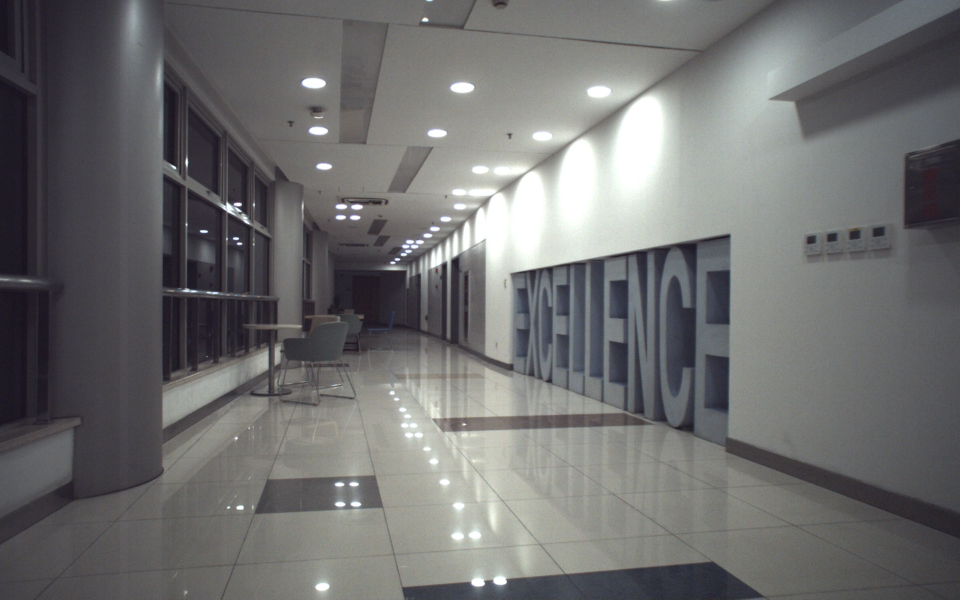
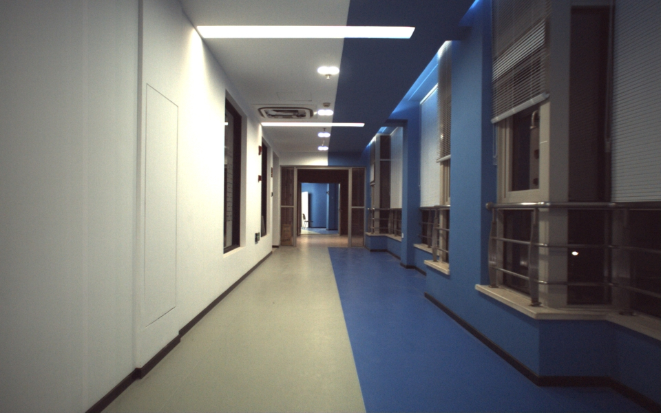
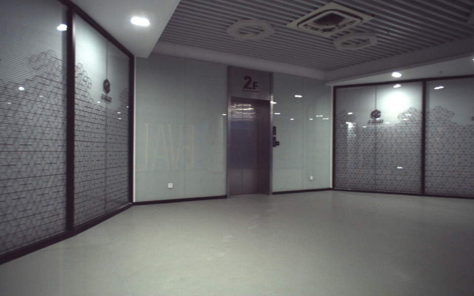
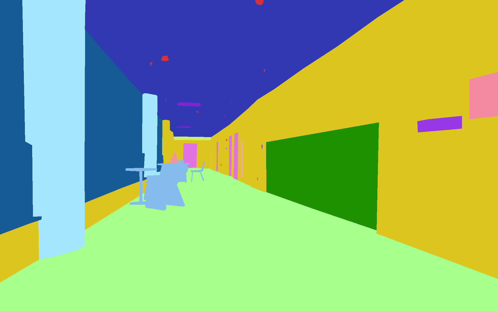
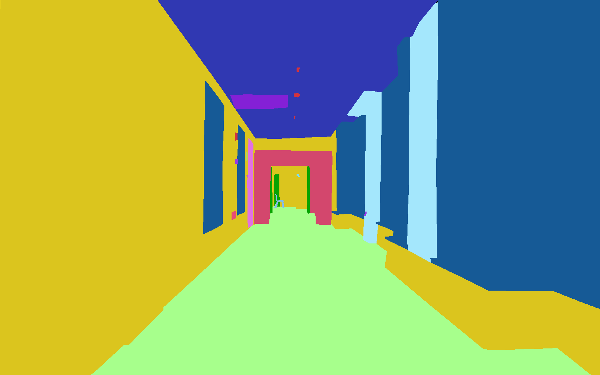
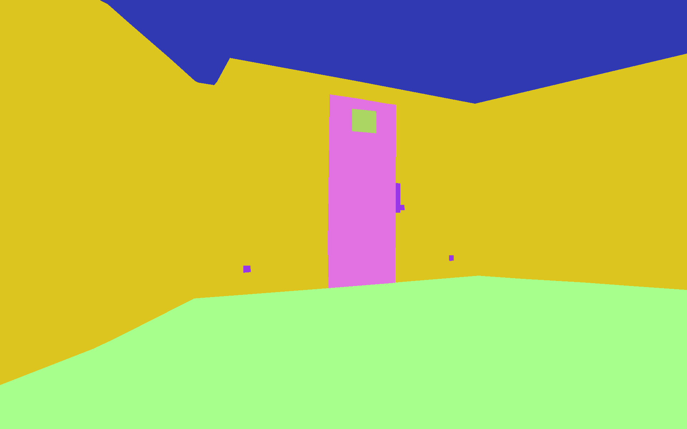
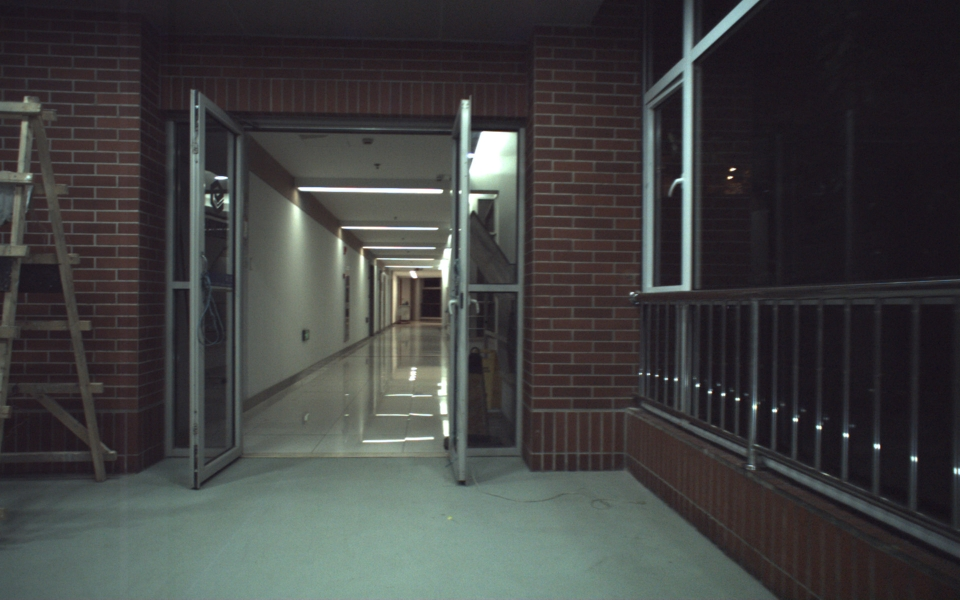
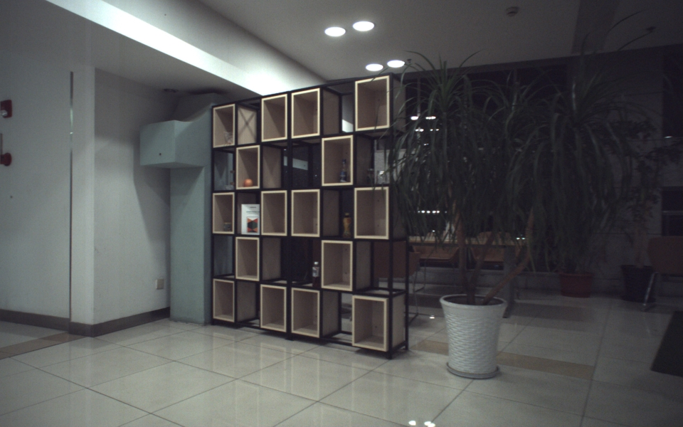
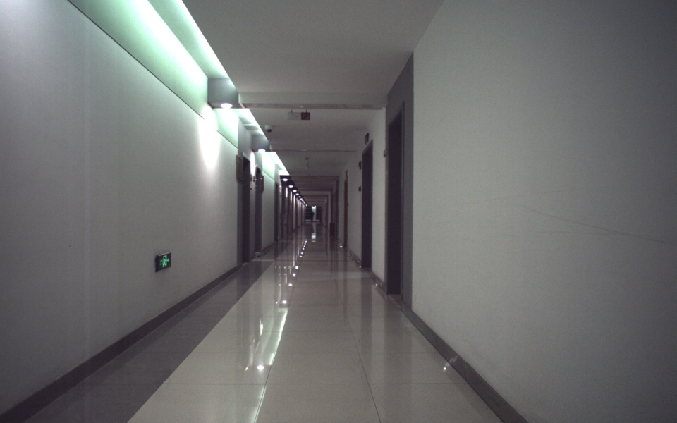
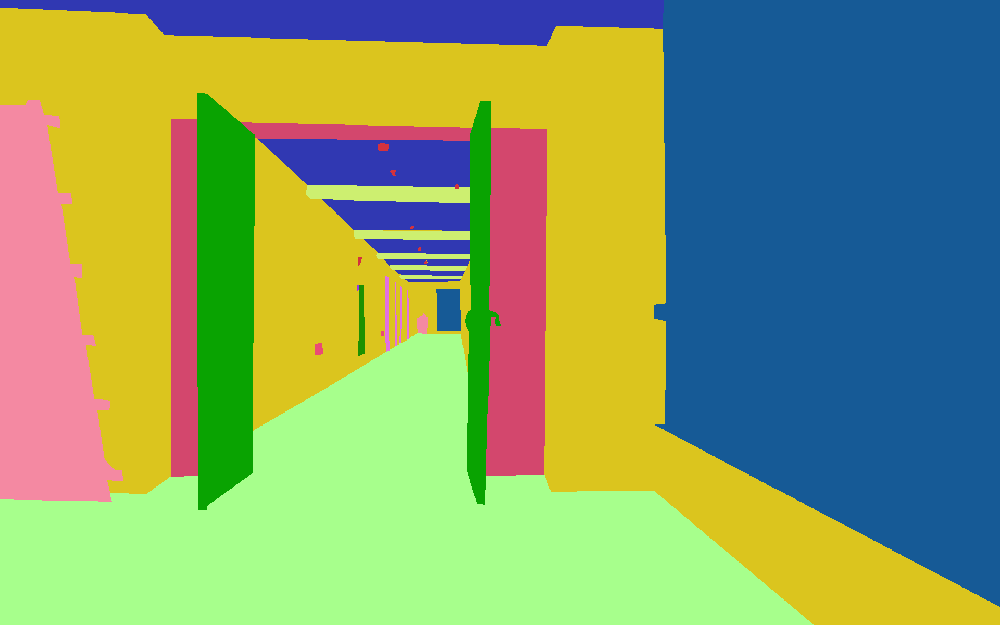
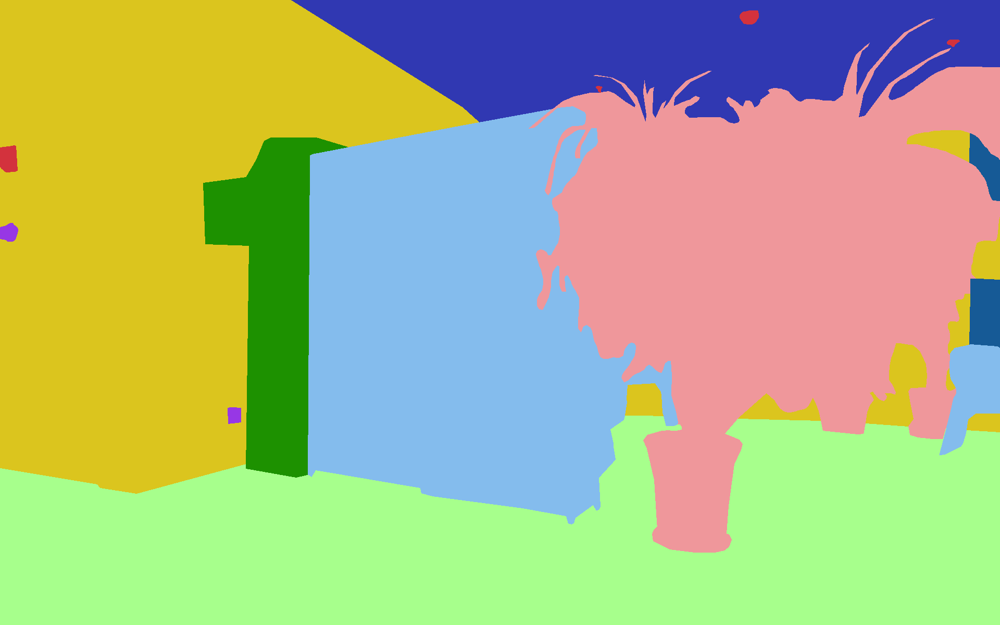
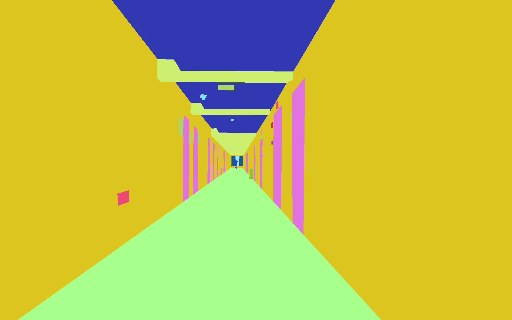
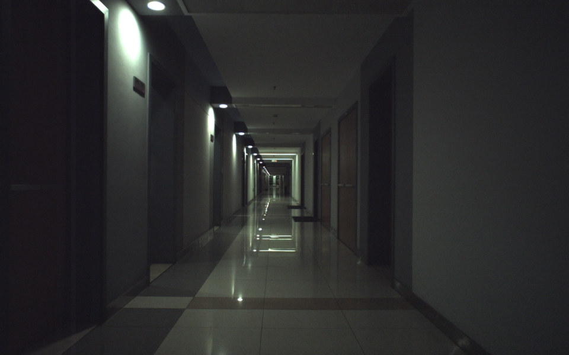
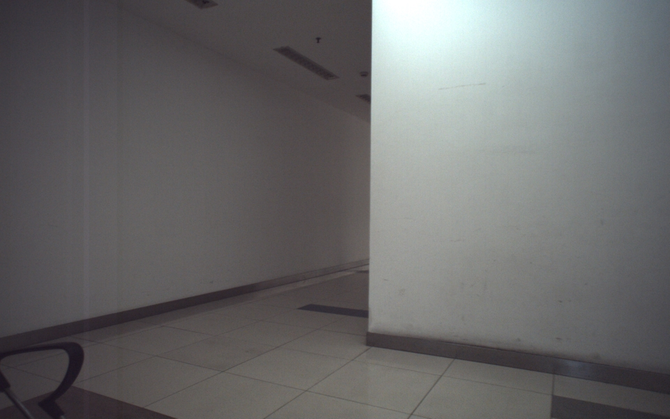
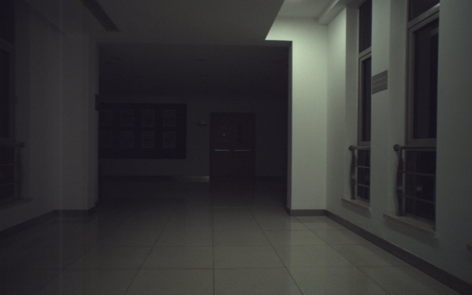
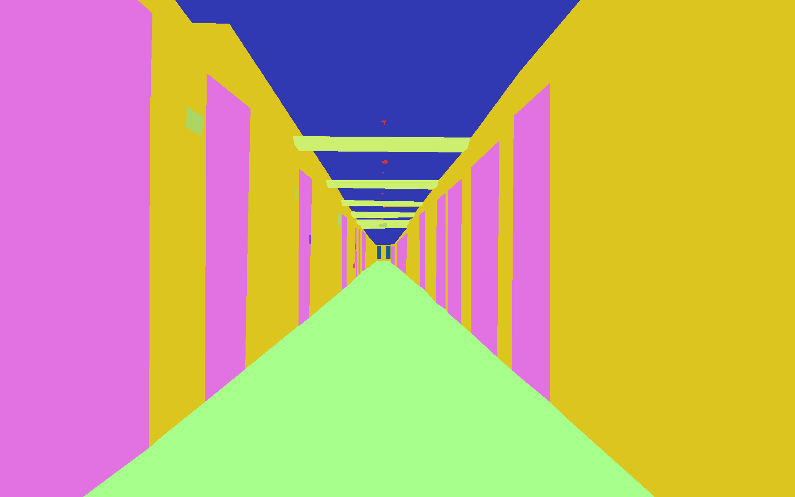

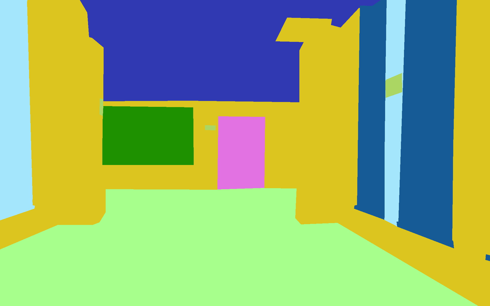

